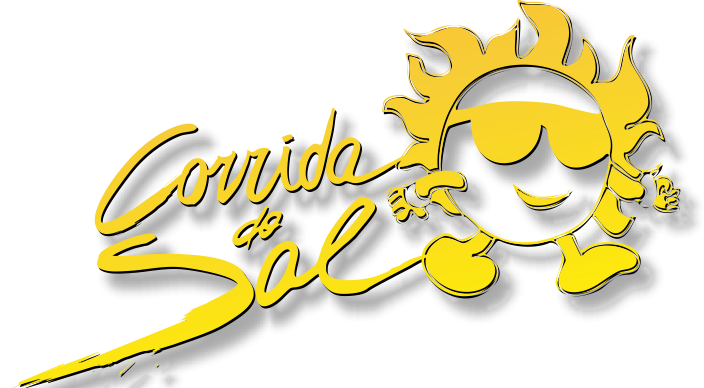
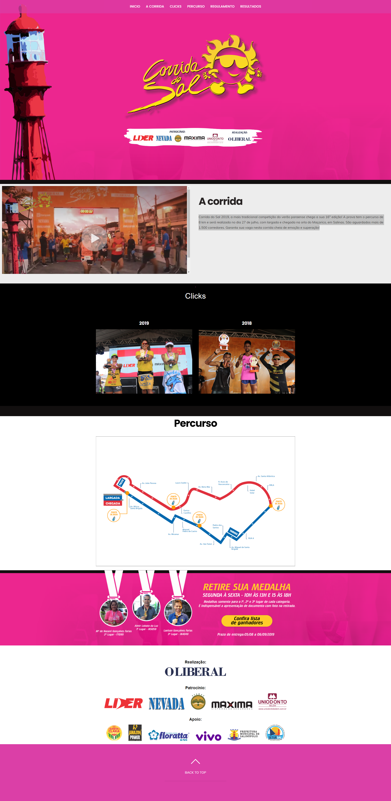

<h1 align="center">
 
  
 
 
Corrida do Sal
</h1>

Corrida do Sal 2019, a mais tradicional competição do verão paraense chega a sua 16° edição! A prova tem o percurso de 8 km e será realizada no dia 27 de julho, com largada e chegada na orla do Maçarico, em Salinas. São aguardados mais de 1.500 corredores.
Projetos desenvolvido pela equipe de desenvolvimento com objetivo de fazer a cobertura do evento para web e mobile

  

    

  

## Tecnologia usada

Usado do modelo de framework WordPress, no servidor linux da libnet

- ⚛️ **Wordpress** — Framework em php 
- ⚛️ **PHP** — PHP para servidor linux
- 💹 **JQuery** — para cadastro de imagens eplugins
- 📄 **MYSQL** — para frot end

## Modelos

1. Hospedado pelo LiBnet url:("http://corridadosal.oliberal.com/"/)
2. Todos os direito autoras pela jornal oliberal: 
3. Modelo apenas ilustratorio 

### Equipe de desenvolvimento

1. David orion (webdeveloper), Luis melo (webdesigner) e Flaberson Moraes (webdeveloper)

